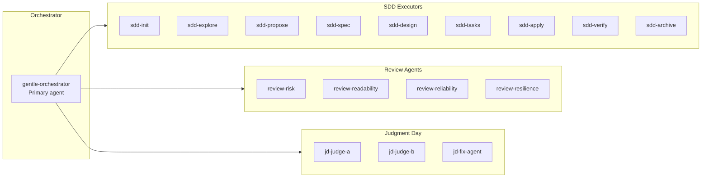
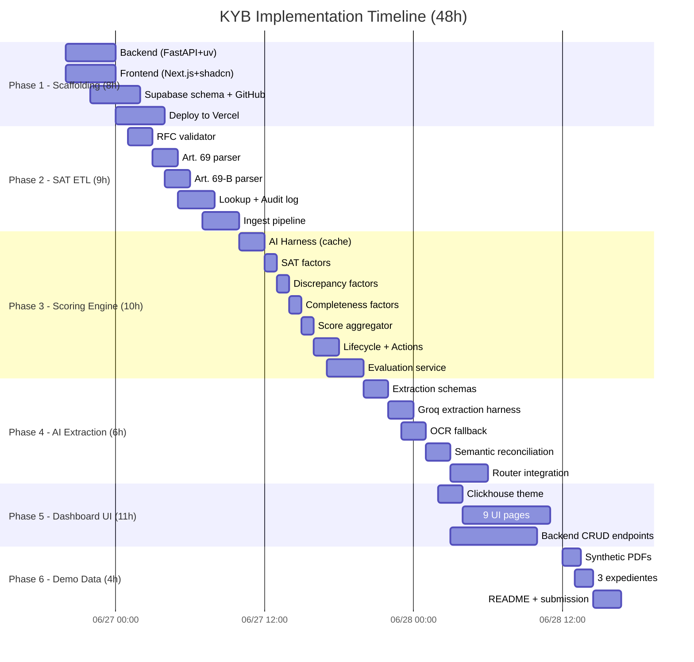
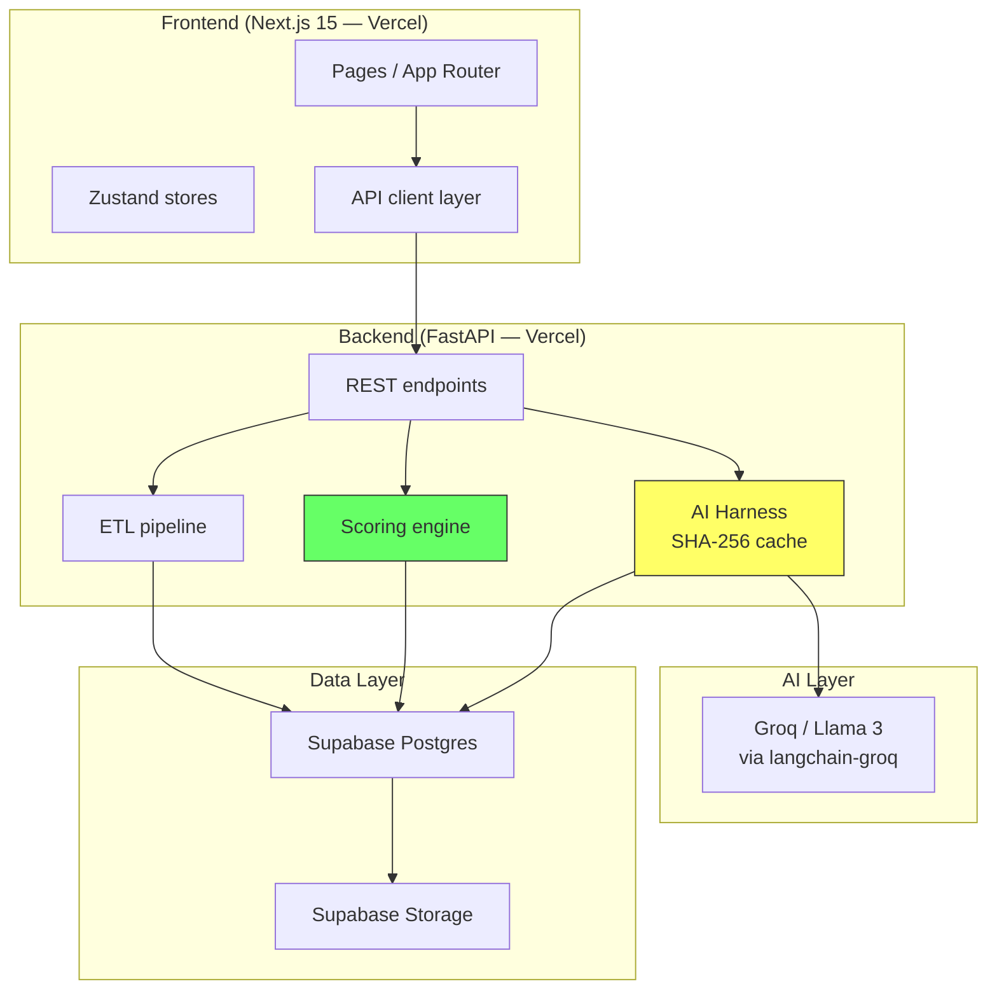

# KYB Platform — Camtom Technical Challenge

A Know Your Business (KYB) platform for a Mexican customs agency (*agencia aduanal*) that determines whether a *persona moral* is `safe`, `review_required`, or `high_risk` for foreign trade operations under Regla 1.4.14 RGCE 2026.

**Live:**
- Frontend: https://frontend-khaki-eight-25.vercel.app
- Backend API: https://backend-nine-snowy-67.vercel.app

---

## How this project was built — the workflow

This project was developed using **Gentle AI** (Spec-Driven Development), a structured AI pipeline where an orchestrator agent delegates each phase to dedicated sub-agents with fresh context. Every phase has explicit inputs, outputs, and validation gates.

```mermaid
flowchart LR
    subgraph Planning
        A[Gemini 3.1 Pro Deep Research<br/>Domain investigation]
        B[sdd-explore<br/>Codebase mapping]
        C[sdd-propose<br/>Change proposal]
    end

    subgraph Specification
        D[sdd-spec<br/>Delta specs & scenarios]
        E[sdd-design<br/>Technical design]
    end

    subgraph Execution
        F[sdd-tasks<br/>Task breakdown]
        G[sdd-apply<br/>Implementation x6]
        H[sdd-verify<br/>Test & validate]
    end

    subgraph Delivery
        I[Fresh-context PR review<br/>R1-R4 review agents]
        J[PR merge → main]
        K[sdd-archive<br/>Persist final state]
    end

    A --> B --> C --> D --> E --> F --> G --> H --> I --> J --> K
```



| Phase | Tool | What happened |
|---|---|---|
| **Domain research** | Gemini 3.1 Pro (Deep Research) | 1 prompt → 30-page investigation of SAT fiscal lists, RGCE 2026 Regla 1.4.14, scoring algorithms |
| **Planning** | Claude Code + Gentle AI SDD | sdd-propose → sdd-spec → sdd-design → sdd-tasks, all orchestrated by gentle-orchestrator |
| **Execution** | Claude Code + SDD sub-agents | 6 phases, each with fresh sdd-apply sub-agent, sdd-verify validation, and gatekeeper checks |
| **Review** | R1-R4 review agents + Engram | Fresh-context adversarial review on every PR: Risk, Readability, Reliability, Resilience |
| **Memory** | Engram (persistent) | Cross-session memory: 63 observations across 6 sessions, every decision/bug/discovery saved |

> **The orchestrator never writes code.** It delegates. Each sub-agent gets a fresh context, does one job, and returns. The orchestrator validates the result before advancing — this is how we eliminate hallucination drift and keep the system predictable.

---

## Tech stack

### Why these tools, when they were used, and how they shaped the outcome

| Tool | Used for | Used when | Why |
|---|---|---|---|
| **Next.js 15** (App Router) | Frontend framework | Fase 5 (UI/Dashboard) | Native Vercel deploy, App Router for layout/loading conventions, RSC-ready |
| **Tailwind CSS + shadcn/ui** | Styling & component system | Fase 5 | Design-system-in-a-box: `shadcn@latest add button -b base` gives you a themed, accessible Button in one command |
| **Zustand** | Client state | Fase 5 | Minimal (<1KB), no boilerplate, works outside React tree for API client state |
| **FastAPI** (Python) | Backend API framework | Fases 1–4 | Native async, Pydantic schemas → auto OpenAPI, built-in validation |
| **uv** (Astral) | Python package & project manager | Fase 1 (scaffolding) | 10x faster than pip, native pyproject.toml support, single-binary install |
| **Supabase** (cloud only) | Postgres + Storage + Auth | Fases 1–4 | Postgres with REST API built-in, Storage for PDFs, no local Docker needed |
| **LangChain + langchain-groq** | AI orchestration | Fase 4 (AI extraction) | Structured LLM calls with Pydantic output parsers, retry logic |
| **Groq (Llama 3)** | LLM inference | Fase 4 | 500+ tok/s on Llama 3, free tier, no rate limits for sandbox use |
| **pnpm** | Node package manager | Fase 5 | Disk-efficient, strict, faster than npm/yarn |
| **Vercel** | Deployment (both services) | Fase 1 (deploy) | Zero-config git push deploy, Python runtime support, preview deployments per branch |

### The meta-tools: Gentle AI, SDD, Codegraph, and Engram

#### Gentle AI — orchestrated sub-agent pipeline

**What:** An agent architecture where a lightweight orchestrator (`gentle-orchestrator`) delegates every task to a dedicated sub-agent. The orchestrator never writes code — it manages context, validates gates, and synthesizes results.

**Used when:** Throughout the entire project. Every Fase (1–6) was implemented via the same pipeline: propose → spec → design → tasks → apply → verify → archive.

**Why:** Three reasons:

1. **Fresh context per task.** Each sub-agent starts with zero baggage. It reads only what it needs (spec + design + previous apply-progress) and produces only its artifact. No hallucination drift, no context bleed between tasks.

2. **Idempotent phases.** Same inputs → same outputs. The orchestrator validates each phase result against a contract (status, artifacts, risks, next_recommended) before advancing. If a phase fails the gatekeeper, it re-runs with corrective feedback — not a blanket retry.

3. **Testable workflow.** Every phase has explicit dependencies (proposal → spec → design → tasks → apply → verify → archive). You can read the SDD progress ledger (`.superpowers/sdd/progress.md`) and trace exactly what each phase produced, what it found, and what it deferred.

#### Codegraph — surgical code intelligence

**What:** A pre-computed knowledge graph of every symbol, edge, and file in the codebase, stored in SQLite. One `codegraph_explore("symbol_name")` call returns the verbatim source + call path + blast radius — replacing 4–10 file reads.

**Used when:** Before every edit or structural question. The `CLAUDE.md` rule says: "Regla de oro: antes de leer, consultá CodeGraph."

**Why:** Context window is finite. Reading 4 files to trace a function's call path uses 12–15K tokens. Codegraph does it in one call (~2–3K tokens). This is the difference between understanding a flow in 5 seconds vs. 5 minutes of file-hopping.

#### Engram — persistent memory across sessions

**What:** A vector/token memory system that survives across Claude Code sessions and compactions.

**Used when:** Every session start (recovery), after every decision/bugfix/discovery (proactive save), and at session end (summary).

**Why:** With a 48-hour deadline across 6+ sessions, each session would otherwise start blind. Engram persisted 63 observations across 6 sessions — every bug found, every decision made, every gap discovered. The `mem_context` call at the start of each session recovered exactly what the previous session learned.

---

## The supporting ecosystem: MCP servers, agents, skills, and utilities

Beyond the core meta-tools, the project relied on a broader ecosystem of **MCP servers** (tooling the AI can invoke directly), **specialized agents** (sub-agents with single responsibilities), **skills** (reusable instructions and workflows), and **external utilities** for research and design.

### MCP servers (Model Context Protocol)

Every MCP server listed here is configured in `opencode.json` or `.mcp.json` and was callable by the orchestrator and sub-agents during development — no browser or copy-paste needed.

| Server | Type | Used for | Used when |
|---|---|---|---|
| **Codegraph** | Local (SQLite) | Symbol index, call graph, blast radius; replaces 4–10 file reads per task | Every edit and structural question across all 6 phases |
| **Engram** | Local (`engram mcp`) | Persistent memory: 63 observations saved, cross-session recovery, conflict detection | Session start, after every decision/bugfix, session end |
| **Context7** | Remote (context7.com) | Up-to-date documentation for every library: FastAPI, LangChain, shadcn, Supabase, Next.js, uv | Before every `uv add` or API call — never assumed a library signature from training data |
| **shadcn** | Remote (npx shadcn@latest mcp) | Add/search shadcn/ui components by name with preset support (e.g. `shadcn add button -b base`) | Fase 5 (every UI component: 9 pages, 20+ components) |
| **Vercel** | Remote (Vercel MCP) | Deploy projects, check deployment status, manage environment variables | Fase 1 (deploy), Fase 5 (frontend deploy) |

### Sub-agents (Gentle AI agent registry)

All defined in `opencode.json` under `agent.*`, each with a single responsibility, its own system prompt, and restricted tool access.



| Agent | Tool access | Used for |
|---|---|---|
| **gentle-orchestrator** | bash, edit, question, read, task, write | Coordinates all phases, delegates work, validates gates — never writes code itself |
| **sdd-init** | bash, edit, read, write | Bootstrap SDD context: detect testing capabilities, cache conventions |
| **sdd-explore** | bash, edit, read, write | Codebase mapping, approach comparison |
| **sdd-propose** | bash, edit, read, write | Write change proposals with intent, scope, and approach |
| **sdd-spec** | bash, edit, read, write | Write delta specs with requirements and scenarios |
| **sdd-design** | bash, edit, read, write | Write technical design documents |
| **sdd-tasks** | bash, edit, read, write | Break designs into granular, TDD-ready tasks |
| **sdd-apply** | bash, edit, read, write | **The workhorse** — implements code for one task at a time, with test-first TDD |
| **sdd-verify** | bash, edit, read, write | Validates implementation against spec, runs tests, reports coverage |
| **sdd-archive** | bash, edit, read, write | Closes a change, persists final state |
| **review-risk (R1)** | bash, read | Security audit: secrets, injection, OWASP, privilege boundaries |
| **review-readability (R2)** | bash, read | Code clarity: naming, complexity, magic numbers, dead code |
| **review-reliability (R3)** | bash, read | Test quality: behavior-first, edge cases, determinism, coverage |
| **review-resilience (R4)** | bash, read | Operations: fallbacks, retry, observability, rollback readiness |
| **jd-judge-a / jd-judge-b** | bash, read | Blind dual adversarial review for high-stakes phases (design, apply) |
| **jd-fix-agent** | bash, edit, read, write | Surgical fix of confirmed issues from judgment-day reviews |

### Skills — reusable instruction sets

Skills are `SKILL.md` files loaded by the orchestrator or sub-agents before work. They encode conventions, workflows, and domain knowledge that the agent reads as context — no need to re-explain patterns.

**User-level skills** (installed at `~/.config/opencode/skills/`):

| Skill | What it encodes | Used when |
|---|---|---|
| **branch-pr** | Issue-first PR workflow: verify issue exists, create branch, commit, PR with template | Every phase close (PR creation) |
| **chained-pr** | Split oversized changes into stacked PRs to protect review focus | Review workload guard after sdd-tasks |
| **work-unit-commits** | Plan commits as reviewable work units: tests + code + docs together | Every sdd-apply task |
| **cognitive-doc-design** | Design docs that reduce cognitive load: intent, structure, examples | Writing README, CLAUDE.md |
| **judgment-day** | Blind dual adversarial review + fix + re-judge protocol | Fase 3 design and apply phases |
| **comment-writer** | Warm, direct collaboration comments for PR reviews | PR feedback and review comments |
| **skill-registry** | Index available skills by trigger and path | Session init (refresh registry) |
| **sdd-{phase}** (9 skills) | Full phase contract: inputs, outputs, validation, TDD rules | Each SDD phase delegation |

**Project-level skills** (installed at `.agents/skills/`):

| Skill | What it encodes | Used when |
|---|---|---|
| **shadcn** | Complete shadcn/ui workflow: init, add components, preset codes, styling via CSS variables, CLI patterns | Fase 5 (all UI components) |
| **vercel-composition-patterns** | React composition patterns: compound components, render props, context providers, React 19 API changes | Fase 5 (component architecture) |
| **vercel-react-best-practices** | React/Next.js optimization: bundle splitting, rerender prevention, server/client boundaries, data fetching | Fase 5 (performance patterns) |

### External utilities

| Tool | Used for | Used when |
|---|---|---|
| **Gemini 3.1 Pro (Deep Research)** | Domain investigation: SAT lists, RGCE 2026, scoring algorithms, competitive analysis | Pre-development (1 prompt, ~30 pages) |
| **OpenCode** | Gentle AI orchestrator runtime — manages sub-agent lifecycle, MCP connections, and lightweight coordination tasks | Session init, small coordination tasks |
| **Claude Code** | Primary AI assistant for the entire project — ran all SDD phases (planning, implementation through all 6 fases, review, archival) plus all sub-agent delegations | Every phase: planning, implementation, review, documentation |
| **Groq (via langchain-groq)** | LLM inference for document text extraction and semantic reconciliation | Fase 4 (within the AI Harness) |
| **Supabase CLI** | Apply migrations (`supabase db push`), link project, manage schema versioning | Fase 1 (schema creation), Fase 2 (SAT ETL tables), Fase 3 (scoring tables) |
| **Vercel CLI** | Deploy backend and frontend as independent projects, connect git integration | Fase 1 (initial deploy), Fase 5 (frontend deploy) |

---

## SDD workflow in action: the 6 phases



Each phase followed the same SDD pipeline: a dedicated `sdd-apply` sub-agent received the task brief (from `sdd-tasks`), implemented code and tests, then an `sdd-verify` sub-agent validated against the spec. A fresh-context reviewer (R1–R4 agents) reviewed the PR before merge. Every CRITICAL finding was fixed before the PR reached `main`.

---

## Running locally

### Prerequisites

- Python 3.13 + [`uv`](https://docs.astral.sh/uv/)
- Node.js + [`pnpm`](https://pnpm.io/)
- A Supabase project (cloud — no local Docker stack)
- A Groq API key

### Backend

```bash
# 1. Copy and fill in credentials
cp backend/.env.example backend/.env
# Required: SUPABASE_URL, SUPABASE_SERVICE_ROLE_KEY, GROQ_API_KEY

# 2. Start the API server
cd backend && uv run fastapi dev src/main.py
```

### Frontend

```bash
# 1. Copy and fill in the backend URL
cp frontend/.env.example frontend/.env.local
# Required: NEXT_PUBLIC_API_URL=http://localhost:8000

# 2. Install dependencies
cd frontend && pnpm install

# 3. Start the dev server
pnpm dev
```

### Tests

```bash
cd backend && uv run pytest src/tests/ -v
```

### Demo data

```bash
# Generate synthetic PDFs (text-selectable, not scanned images)
cd backend && uv run python scripts/generate_demo_pdfs.py

# Seed three test expedientes into the database
cd backend && uv run python scripts/seed_demo.py
```

Three synthetic *expedientes* are seeded:
1. **Clean** — uses SAT's official sandbox RFC `EKU9003173C9`, all documents valid, no list hits.
2. **Mitigable discrepancies** — mismatched *razón social* and address, replicating the brief's sample scenario.
3. **High risk** — RFC present in the Art. 69-B Definitivos list, forces `high_risk` regardless of other factors.

---

## Architecture

```
monorepo/
├── backend/     FastAPI + Python 3.13 (uv)    → Vercel Serverless (Python runtime)
└── frontend/    Next.js 15 App Router + TS     → Vercel Serverless (Node runtime)
```

Each service is deployed as an independent Vercel project. The split is intentional:

- **Separation of concerns** — the UI can be replaced or extended without touching business logic.
- **API-first** — the backend is a standalone REST API consumable by any client (CLI, other systems, future mobile app).
- **Thin frontend** — the Next.js project is purely a presentation layer; it holds no business rules and never touches the database directly.



### Data layer

- **Supabase (cloud-only)** — Postgres for structured data, Storage for PDF blobs. No ORM; the backend uses `supabase-py` with raw SQL for clarity and control. Migrations are versioned in `supabase/migrations/` and applied with `supabase db push`.
- The frontend has zero Supabase access — all reads and writes go through the backend REST API.

### AI layer

- **LangChain + langchain-groq** — Groq hosts Llama inference; LangChain structures the calls.
- The LLM is used for two tasks only: extracting structured fields from PDF text, and semantic reconciliation (comparing form data vs. *Constancia de Situación Fiscal* data).
- **The LLM never decides the final classification.** It returns `similarity` (0–1) and `same_entity` (bool); a deterministic rules engine applies fixed thresholds to produce a score and a verdict.
- Every LLM call passes through `AIHarness` (`infrastructure/ai/harness.py`), which computes a SHA-256 hash of the input and caches the result. Identical input → identical output, always. The model never runs twice on the same content.

---

## Scoring rubric

All factors are additive (penalties, never deductions). The LLM provides structured metrics (similarity scores, entity matching); a deterministic rules engine assigns points.

```
▌SAT list factors
 Factor                           Weight   Trigger
 ──────────────────────────────────────────────────────────────────────────
 sat_69b_definitivo               100 pts  CRITICAL BLOCK — RFC in EFOS definitive list (Art. 69-B) → automatic high_risk
 sat_69b_presunto                  40 pts  RFC in EFOS presumptive list (Art. 69-B)
 sat_69b_bis                       35 pts  RFC in undue loss transfer list (Art. 69-B Bis)
 sat_69_incumplido                 25 pts  RFC in delinquent taxpayers list (Art. 69)
 art_49bis_no_verificable           0 pts  Art. 49-Bis has no public list — flagged for manual review

▌Document discrepancy factors (LLM-computed similarity)
 disc_rfc                          50 pts  RFC mismatch across documents
 disc_razon_social                 30 pts  Business name similarity < 0.85
 disc_domicilio                    20 pts  Address similarity < 0.85
 disc_representante                25 pts  Legal representative name mismatch
 disc_fechas                       15 pts  Inconsistent dates across documents

▌Document completeness & freshness factors
 doc_missing                       15 pts  Per missing required document (8 required types)
 doc_data_incomplete               15 pts  Extracted document missing mandatory fields
 doc_expired                       20 pts  Comprobante de domicilio older than 90 days
 csf_stale                         25 pts  CSF older than current calendar month
 manifestacion_incompleta          20 pts  Protesta declaration lacks explicit Art. 69-B/49-Bis clause
 socios_incompletos                20 pts  Acta constitutiva present but no shareholders recorded
 rep_legal_incompleto              15 pts  Representative ID missing full name

▌Structural integrity
 rfc_formato_invalido              60 pts  RFC fails structural validation → score triggers review_required (not high_risk)

▌Decision thresholds
  safe             → score_total < 30
  review_required  → 30 ≤ score_total < 70
  high_risk        → score_total ≥ 70 OR any CRITICAL BLOCK
─────────────────────────────────────────────────────────────────────────
```

---

## Known limitations

These are conscious design decisions, not omissions.

| Area | Status | Reason |
|---|---|---|
| **Art. 49 Bis** (contrabando técnico) | Not implemented | SAT publishes no public list for this article — documented as a known gap, not fabricated |
| **Art. 69-B Bis** | Schema ready, ETL partial | SAT only exposes this via a dynamic web form with no downloadable XLSX; download step is manual |
| **OCR fallback** | Available (`pdf2image` + `pytesseract`) | Groq's Llama does not accept images — OCR extracts text which then feeds the LLM pipeline; quality depends on scan resolution |
| **VUCEM / Opinión de Cumplimiento** | Out of scope | Would require CIEC credentials and SAT web scraping — not appropriate for a sandboxed demo |
| **Authentication** | None | Conscious decision: no auth = no friction for evaluators |
| **Supabase Storage download** | `extract_documento` reads `storage_path` as a local path | In production, this step must first download the blob from Supabase Storage before processing |

---

## How AI is used — and why the verdict is still deterministic

The platform uses AI for perception (reading documents), not for judgment (deciding outcomes).

**Extraction phase:** Groq Llama receives the raw text of a PDF and returns structured fields (*RFC*, *razón social*, *domicilio*, *fecha_emision*). This replaces brittle regex parsing and handles layout variation across document issuers.

**Reconciliation phase:** Groq Llama compares two strings (e.g., the *razón social* the applicant typed in the form vs. the name on the *Constancia de Situación Fiscal*) and returns a `similarity` score and a `same_entity` boolean.

**Scoring phase (deterministic):** The rules engine receives those metrics and applies hard-coded thresholds. A similarity below 0.85 adds 30 points (`disc_razon_social`) or 20 points (`disc_domicilio`) — the model has no say in what those thresholds are or what they imply. A score ≥ 70 is always `high_risk`; there is no "but the AI thinks it's fine" override.

**Harness engineering:** `AIHarness` wraps every LLM call with a SHA-256 content hash. The result is cached so that re-evaluating the same document with the same data produces byte-identical output without hitting the model again. This makes the platform fully auditable: given the same documents, the same RFC, and the same SAT fiscal lists, the decision will always be identical.

---

## Implementation plan

The full architecture decisions, data model, exact scoring rationale, and granular TDD task breakdown are in:

[`docs/superpowers/plans/2026-06-27-kyb-agencia-aduanal.md`](docs/superpowers/plans/2026-06-27-kyb-agencia-aduanal.md)

---

## The meta-lesson: fewer prompts, more structure

This project was built with **3 prompts** — not 300.

1. **Gemini 3.1 Pro (Deep Research)** (1 prompt): Domain investigation of SAT lists, RGCE 2026, scoring algorithms.
2. **Phase start** (1 prompt per session): "Continue the implementation; detect the current state from git, Engram, and the plan."
3. **Phase continuation** (1 prompt per task, auto-generated by SDD): The orchestrator delegates to sub-agents with task-specific instructions.

Why this matters:

- **Fewer prompts → less ambiguity.** Each prompt is the output of a deterministic pipeline (SDD), not a free-form conversation.
- **Sub-agents are disposable.** A sub-agent that produces a bad artifact costs the orchestrator's re-run, not a manual correction.
- **Fresh context catches bugs.** The R1–R4 review agents read the PR diff with no memory of how it was built. They find things the implementer's context-blindness hides.
- **Engram is the single source of truth.** 63 observations across 6 sessions. Every decision, bug, and gap is recoverable without re-asking the user.

This is the difference between "prompt engineering" and **pipeline engineering** — designing a repeatable, testable, auditable workflow instead of hoping the next prompt will guess right.
